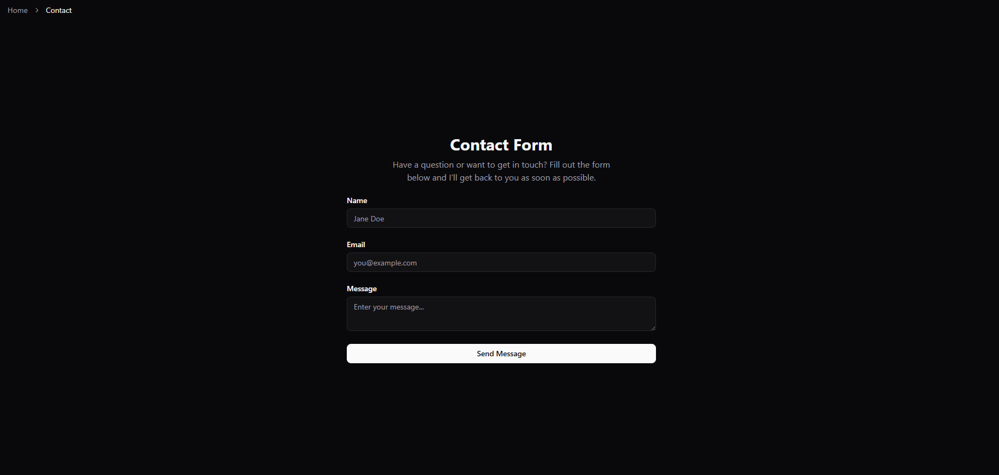
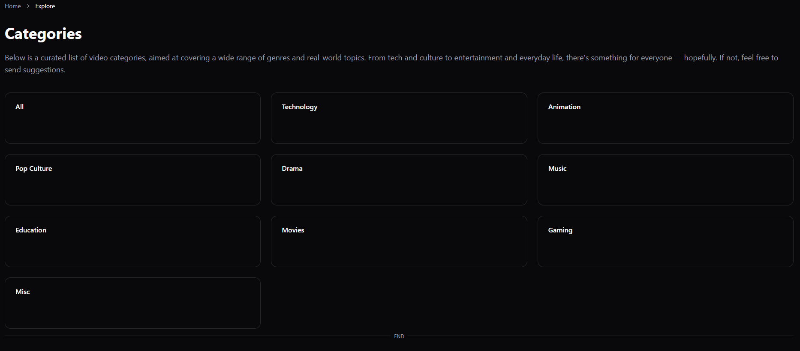
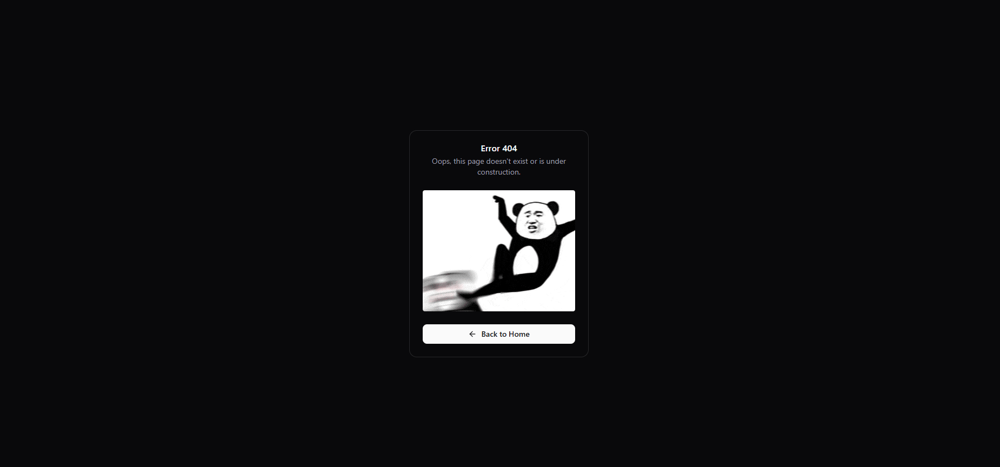
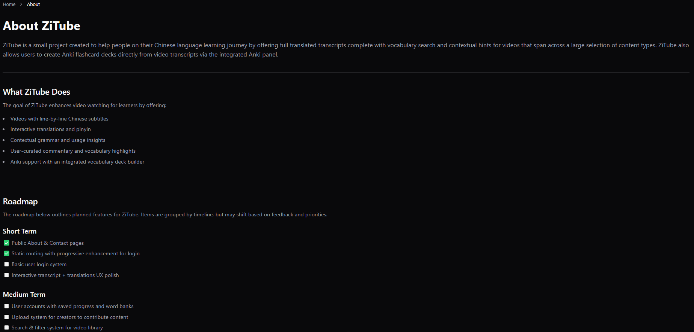

# 15/4/25 Log

Progress:

- Created all routes that can be statically generated for SEO purposes.
- Started on video page and category pages.

Issues:

- Shadcn/vue documentation inconsistent with exported vue files
  - Temporary fix was made by making use of Reka UI's component for pagination, although for consistency, this should be changed later once the docs update.
- CSS still looks terrible, need to add green accent to site, and get Tailwind intellisense to cooperate.

Progress Screenshots:

